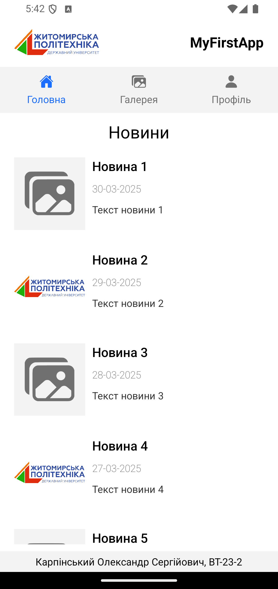
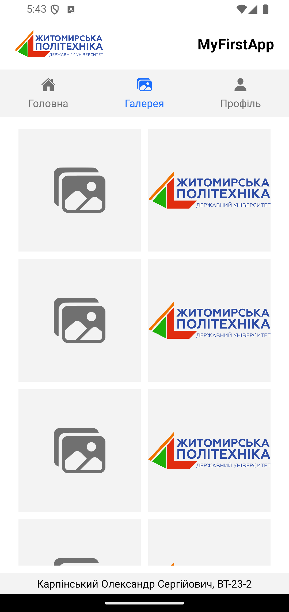
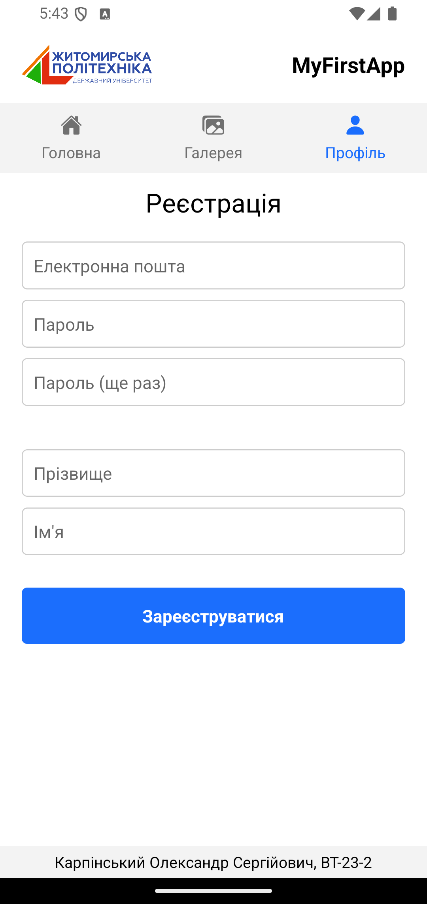

# App for lab №1
To run the project, follow these steps:

1. Navigate to the root directory of the project.
2. Run the command ```npm start to start``` the project.
3. After the project has started, you can use one of the following methods to connect:
    - Open the app in a simulator or on a physical device connected to your computer.
    - Use Expo Go on your mobile device to connect to the project.
    - Use the web version of the project, if available.
## Screenshots
1. **Home screen**

2. **Gallery screen** 

3. **Profile screen**
